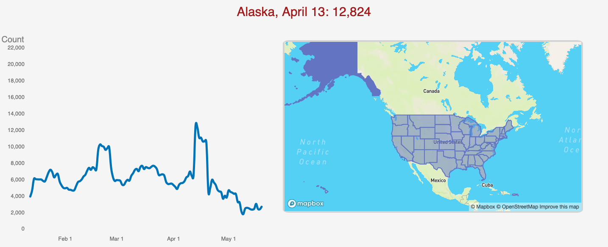

#COVID-19 Vaccination Tracking Website
####Chessa Hoekstra

The spread of coronavirus (or COVID) over the past year has dominated news cycles both nationally and globally. Inherently statistical, case counts posed challenges on how to best make sense of and visualize large datasets. Most tend to agree that data (and corresponding insights) need to be accessible to the general public, but this is no easy task. Accordingly, people have set out to make easily understood source websites and visualizations.

Since the start of 2021, a new (more optimistic) set of numbers has garnered similar need for visualization: vaccination rates. I propose a tool that is straightforward in that it gathers data directly from the CDC, simple in that it avoids advanced metrics, and efficient in that it is delivered all on one web page.

###Instructions
My website is hosted at https://6859-sp21.github.io/final-project-not-a-number/

Link to [Paper](FinalPaper.pdf)

Link to [Video](https://youtu.be/_6xtMihVcsk)

###Design Commentary
This project was fun to do because I was working with what I felt was relevant data. However, it was harder to prove that it was relevant with a concrete question. I realized when watching other presentations, however, that "people should see this data" is enough of a purpose for why I chose it.
That being said, I faced some bugs and time constraints, so I didn't get to implement all the demographics I had in mind by the time of the due date. In the future, I may build on this especially as vaccination data grows. It is never easy to know which interactions will take a while to implement and which you will end up getting to work.

One aspect that was both an advantage and disadvantage was the fact that I was anchored in my encodings (line chart for time data, and a map for state-specific data). On one hand this makes the website intuitive to the user, but on the other hand it limited my creativity looking back. I'm very conflicted since I know there are really out-of-the-box visualizations possible, but don't know if it's a good idea to use them if they aren't necessary.